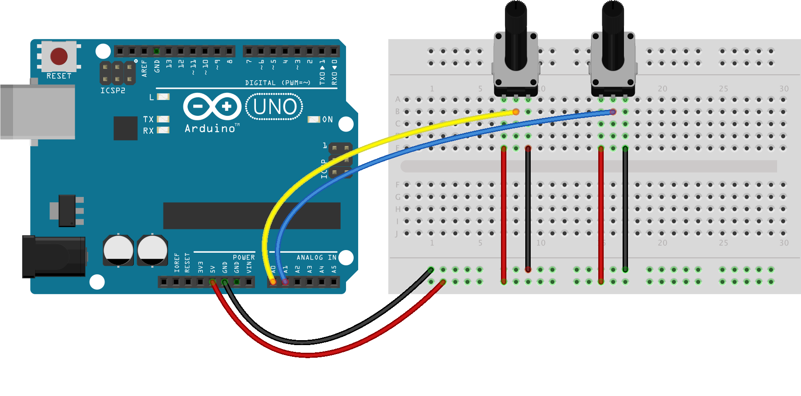
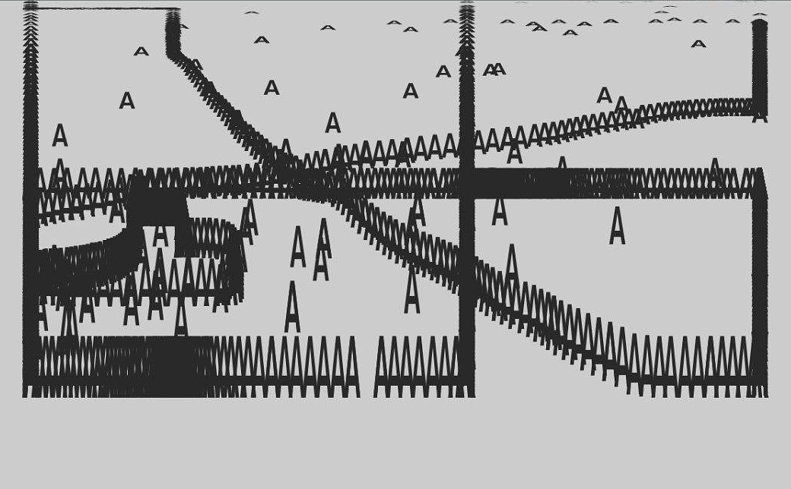

# DrawBot

## Matériel
 * Arduino Uno
 * 2 potentiomètres 10K

## Logiciels
 * [Arduino IDE](https://www.arduino.cc/en/Main/Software) avec le sketch StandardFirmata
 * [Processing 3](https://processing.org/download)
 * Dessin SVG

## Schéma de montage

## Output

## Amélioration
- Multi formes
- Couleurs
- Multi PDF
